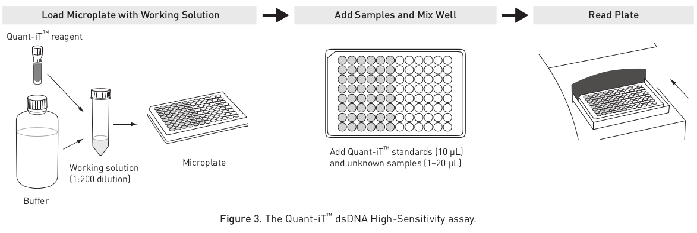
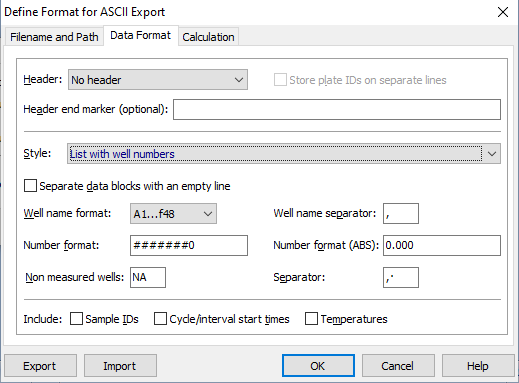
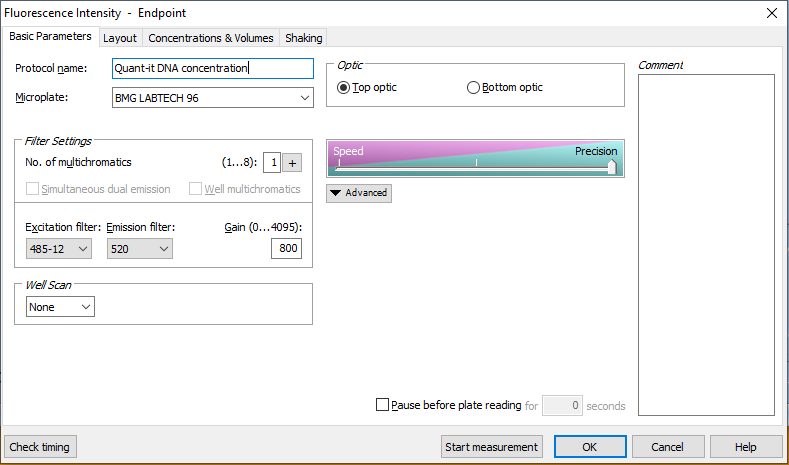
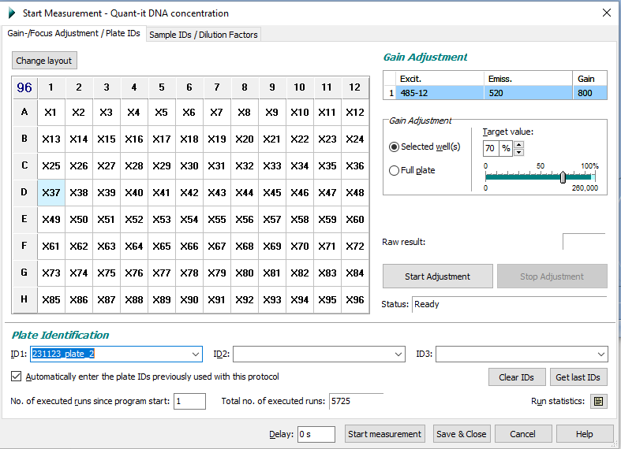

```{r}
rm(list = ls())
graph_par <- c(las=1, bty="l", col.axis="gray30")
```

## Objective

This document is a template for analyzing quantification data of dsDNA in 96-well plate using the [Quant-it (ThermoFisher)](https://www.thermofisher.com/order/catalog/product/Q33120).

## Material

- Microplates for Fluorescence-based Assays, for instance [these ones](https://www.thermofisher.com/order/catalog/product/M33089).

- Omega FLUOstar Omega (BMC Biotech) plate reader

- Quant-it dsDNA High Sensitivity kit (ThermoFisher) either 1X solution or reagent + buffer

## Plate preparation

::: column-page

:::

1.  Load 200 μL of the working solution into each microplate well using a black flat bottom 96-well plates.
2.  Add 10 μL of each λ DNA standard to separate wells and mix well. Duplicates or triplicates of the standards are recommended.
3.  Add 1-2 μL of each unknown DNA sample to separate wells and mix well. The fluorescence signal is stable for 3 hours at room temperature.
4.  Measure the fluorescence using the Omega FLUOstar Omega (BMC Biotech) plate reader. See below for protocol parameters.

::: callout-important
**Remove the plate lid before placing the plate in the plate reader!**
:::

- Set up the data export format as in @fig-dataformat. You can save the data export format and import it from a file later.

{#fig-dataformat}

- Go to the protocol manager and look for **Quant-it DNA concentration** (or create it if not existing), which should look like @fig-protocol. Check the layout tab and make sure all wells are selected for reading.

{#fig-protocol}

- Then go to start measurement and give a name to your plate in *ID1* (@fig-reading). Do not change the gain adjustment and leave it to 800.

{#fig-reading}

- Start measurement. If the data export format has been correctly set up a file containing the raw data should be automatically saved in your preferred directory.

## Data preparation

1. Make sure that:

  - All your data files are in the `data` directory
    - Create one folder per date of measurement, so that the plate with standards and those measured at the same time are in the same folder.
  - Each file contains in its name `plate1` with the number of the plate and no space
  - The plates containing standards contain `standard` in the the fluorescence file name in addition to the plate number.
  - Example:
    - `231204_standard_plate1.csv` for a plate containing both standards and samples
    - `231204_plate2.csv` for a plate that contains only samples

2. Add in the code chunk below the column numbers of the standards.
  - Example: In the example data, standards were in column 1 (A1 to H1), 2 (A2 to H2) and 3 (A3 to H3). So we set `standard_col <- c(1, 2, 3)`.
3. Add to the code chunk the concentration (ng/µL) of each standard for each row (A to H) in the code below. The Quant-it standard concentrations typically are 0, 0.5, 1, 2, 4, 6, 8, 10 ng/µL.
4. Add the volume of sample in µL you used in the reaction (typically 1 sµL), as well as the volume of standard (typically 10 µL)
5. Add the relative path for the folder containing the result files for plates done on the same day including standard curves.
  - Example: for the example dataset `file_path <- "data/20231204"` 
6. Add the base of the result file name.
  - Example: here I simply put the experiment date `file_base_name <- "231204"`. The output file will be named "results/231204_Quantit_results.csv"

```{r}
# Columns containing standards
standard_col <- c(1, 2, 3)

# Rows containing standards and their concentration in ng/µL
standard_row <- c(
  "A" = 0,
  "B" = 0.5,
  "C" = 1,
  "D" = 2,
  "E" = 4,
  "F" = 6,
  "G" = 8,
  "H" = 10
)

# Volume of sample in µL
vol_samples <- 1
# Volume of standards in µL
vol_standards <- 10

# make a list of all the quantification files from a given date (containing 'plate' in the name)
file_path <- "data/20231204"
fluo_files <-
  list.files(path = file_path, pattern = "plate", full.names = T)

# Output file base name
file_base_name <- "231204"
```

6. You should be all set to render the Quarto document!


## Reading files 

The code chunk below will load all the data files and compute de standard curve.

```{r}
# Now we are reading all the plate files and computing the linear regression for the standard curve
res <- NULL
for (i in 1:length(fluo_files)) {
  f <- fluo_files[i]
  tmp <- # reading the plate file
    read.table(
      f,
      h = F,
      sep = ",",
      col.names = c('well', 'fluo_intensity')
    )
  ## Removing spaces in well names  
  tmp$well <- gsub(" ", "", tmp$well)
  ## Turning fluorescence data to numeric
  tmp$fluo_intensity <- as.numeric(tmp$fluo_intensity)

  # Separating standard and real samples
  if (grep('standard', f) == 1) {
    tmp$column <- gsub("[A-H]", "", tmp$well)
    tmp$row <- gsub("[0-9]", "", tmp$well)
    # make a subset table with standard only
    st <-
      subset(tmp, tmp$column %in% standard_col & row %in% names(standard_row))
    st$concentration <- standard_row[st$row]
    # remove the standard from the table
    tmp <-
      subset(
        tmp,
        !tmp$column %in% standard_col & tmp$row %in% names(standard_row)
      )

    # Make a linear model to calculate standard curve slope and intercept
    mod <- lm(fluo_intensity ~ concentration, data = st)
  }

  tmp$plate <- gsub(".*(plate[0-9]+).*", "\\1", f)
  tmp$dilution <- vol_standards / vol_samples
  res <- rbind(res, tmp)
  rm(tmp)
}
```

## Standard curves

Plotting the standard curve and the regression line to check everying looks good:

```{r}
#| fig-width: 5
#| fig-height: 5

par(graph_par)
par(mfrow=c(1,1), mar=c(4,6,4,1), las=1, xpd=F)
plot(fluo_intensity~concentration, 
     data=st,
     xlab="Concenration (ng/µL)",
     ylab="",
     main="Standard curve",
     pch=21, col="steelblue", bg="steelblue")
abline(a=mod$coefficients[1],b=mod$coefficients[2],col="gray")
text(8,10000, paste("R2 =", round(summary(mod)$r.squared, digits = 3)))
mtext("Flurescence intensity", 2, line=4, las=3)
```

## Sample quantification

Sample concentration in ng/µL is estimated using the sample fluoresence intensity and the intercept and slope from the standard curve. The result is then saved in a CSV file in the `results` folder.

```{r}
#| tbl-cap: Sample concentration estimates from the standard curve

# Estimation of the sample concentration from the slope and intercept of the standard curve
res$concentration_ng_ul <-
  ((res$fluo_intensity-mod$coefficients[1])/mod$coefficients[2])*res$dilution

# Change below with the file name you want for results
file_name <- paste0(file_base_name, "_Quantit_results.csv")
write.table(res, file = file.path("results", file_name),
            sep=",", row.names = F)

kableExtra::kable(res[,c("plate", "well", "concentration_ng_ul")], "html") |> 
  kableExtra::kable_styling("striped") |>
  kableExtra::scroll_box(height = "500px")
```

## Plot concentration

A simple plot to visualise the sample concentration. Samples with concentration lower than 10 ng/µL will be colored in pink.

```{r}
par(graph_par)
n <- sort(res$concentration_ng_ul)
c <- ifelse(n>10, 'chartreuse4', 'salmon')
p <- barplot(n, 
             ylab="DNA cencentration (ng/µL)", 
             col= c,
             main='Quant-it quantifications',
             border= c)
legend("topleft", fill=c('chartreuse4', 'salmon'), c(">10 ng/µL", "<10 ng/µL"))
abline(h=10, lty=2, col="red")
```

## Session info

```{r}
sessioninfo::session_info()
```